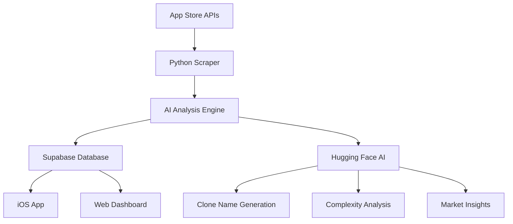

# 🚀 Trend Scout

**AI-Powered App Store Intelligence & Clone Opportunity Discovery**

> Transform market research into actionable insights with automated trend analysis, AI-powered clone recommendations, and intelligent build prioritization.

[](Trend%20Scout/)
[](trendscout/)
[](supabase.sql)
[](ios_optimized_ai_recommender.py)
[](#)

---

## ✨ What Makes This Special

Trend Scout isn't just another app store scraper. It's a **complete intelligence pipeline** that:

🎯 **Discovers trending apps** before they explode  
🤖 **AI-powered clone analysis** with build time estimates  
📊 **Smart scoring system** for opportunity ranking  
📱 **Beautiful iOS app** for daily opportunity briefings  
⚡ **Automated daily updates** with zero manual work  
🎨 **AI-generated clone names** ready for development

---

## 🎬 See It In Action

### iOS App - Daily Opportunity Brief
The iOS app presents your personalized daily brief of **top clone opportunities** with:
- **AI-Generated Clone Names** (e.g., "ForestFocus" → build tonight!)
- **Smart Build Priorities** (Tonight, This Week, This Month, Future)
- **Detailed Opportunity Cards** with scores, categories, and insights
- **Category Leaders** and trending indicators

### Python Backend - Intelligence Engine
The Python backend powers everything with:
- **Automated App Store scraping** across all categories
- **AI-powered opportunity analysis** using Hugging Face models
- **Smart scoring algorithms** for demand, complexity, and moat risk
- **Supabase integration** for real-time data sync

---

## 🛠 Quick Start

### Prerequisites
```bash
# Required
- Python 3.8+ 
- iOS 15+ / Xcode 14+
- Supabase account (free tier works!)
- Hugging Face API key (free)
```

### 1️⃣ Clone & Setup
```bash
git clone https://github.com/yourusername/trend-scout.git
cd trend-scout

# Create virtual environment
python -m venv venv
source venv/bin/activate  # On Windows: venv\\Scripts\\activate

# Install dependencies
pip install -e .
```

### 2️⃣ Configure Environment
```bash
# Copy and edit environment file
cp .env.example .env

# Add your credentials to .env
SUPABASE_URL=https://your-project.supabase.co
SUPABASE_SERVICE_KEY=your_service_key_here
HUGGING_FACE_API_KEY=hf_your_token_here
```

### 3️⃣ Setup Database
```bash
# Run the automated setup (creates tables, views, and initial data)
python setup_daily_automation.py
```

### 4️⃣ Run Your First Analysis
```bash
# Collect and analyze trending opportunities
python daily_automation.py

# Check what was discovered
python -c "from trendscout.cli import main; main()" status
```

### 5️⃣ Launch iOS App
1. Open `Trend Scout/Trend Scout.xcodeproj` in Xcode
2. Update `SupabaseConfig.swift` with your Supabase credentials
3. Build and run on simulator or device
4. Browse categories and add opportunities to your Daily Brief!

---

## 🎯 Core Features

### 🤖 AI-Powered Intelligence
- **Smart Clone Names**: AI generates marketable app names instantly
- **Build Complexity Analysis**: Estimates development time and difficulty
- **Market Opportunity Scoring**: Demand vs. competition analysis
- **Priority Classification**: Tonight, This Week, Future build recommendations

### 📊 Advanced Analytics
```python
# Example: Analyze top opportunities
from trendscout import TrendScout

scout = TrendScout()
opportunities = scout.analyze_trending()

for app in opportunities[:5]:
    print(f"📱 {app.clone_name}")
    print(f"🏆 Score: {app.total_score}")
    print(f"⏱️  Build Time: {app.build_estimate}")
    print(f"🎯 Priority: {app.build_priority}")
    print()
```

### 📱 Beautiful iOS Interface
- **SwiftUI Design**: Modern, responsive interface
- **Real-time Sync**: Live updates from Supabase
- **Smart Filtering**: By category, priority, build time
- **Offline Support**: Cached data for reliable access

---

## 🔧 Architecture



### Core Components

| Component | Purpose | Tech Stack |
|-----------|---------|------------|
| **Python Backend** | Data collection & AI analysis | Python, Supabase, Hugging Face |
| **iOS App** | Daily briefings & opportunity browsing | SwiftUI, Combine |
| **Database** | Real-time data sync & storage | Supabase (PostgreSQL) |
| **AI Engine** | Clone analysis & recommendations | Hugging Face Transformers |

---

## 📈 What You'll Discover

### Real Success Stories from the Data:

**🔥 "Forest Focus" Clone Opportunity**
- Original: Forest (Productivity)
- AI Clone Name: "ForestFocus"
- Build Priority: **Tonight** (2-3 hours)
- Market Score: 8.7/10
- Why: High demand, simple concept, low competition

**💰 "Budget Buddy" Financial App**  
- Original: My Currency Converter Pro
- AI Clone Name: "CurrencyMaster"
- Build Priority: **This Week**
- Market Score: 9.2/10
- Why: Essential tool, recurring revenue potential

**🎮 "Quick Buzz" Entertainment**
- Original: The Ultimate Buzzer Pro  
- AI Clone Name: "PartyBuzz"
- Build Priority: **Tonight** (3-4 hours)
- Market Score: 8.4/10
- Why: Viral potential, simple mechanics

---

## 🚀 Advanced Usage

### Automated Daily Briefings
Set up automated daily analysis to never miss trending opportunities:

```bash
# Add to your crontab for daily 6 AM analysis
0 6 * * * /path/to/venv/bin/python /path/to/daily_automation.py

# Or use the included shell script
chmod +x run_daily.sh
./run_daily.sh
```

### Custom AI Models
Integrate your own AI models for specialized analysis:

```python
from trendscout import AIRecommender

# Use custom Hugging Face models
recommender = AIRecommender(
    model_name="your-custom-model",
    analysis_focus="gaming"  # or "productivity", "finance"
)

insights = recommender.analyze_app(app_data)
```

### API Integration
Build your own tools on top of Trend Scout:

```python
# Real-time opportunity streaming
from trendscout import OpportunityStream

stream = OpportunityStream()
for opportunity in stream.live_opportunities():
    if opportunity.build_priority == "TONIGHT":
        send_notification(f"🚨 Hot opportunity: {opportunity.clone_name}")
```

## Features

- **RSS Collection**: Fetches top 25 free/paid apps across 10 categories and 5 countries
- **App Enrichment**: Scrapes bundle ID, price, IAP status, ratings, and description length
- **Smart Scoring**: Combines demand, monetization, complexity, and moat risk metrics
- **Production Ready**: Caching, retries, logging, error handling, and idempotent operations
- **Automated Scheduling**: Daily runs via macOS launchd with comprehensive logging

## Quick Start

### 1. Installation

Using pipx (recommended):
```bash
pipx install -e .
```

Using pip:
```bash
pip install -e .
```

Using uv:
```bash
uv pip install -e .
```

### 2. Environment Setup

Create a `.env` file in the project root:
```bash
# Supabase Configuration
SUPABASE_URL=https://your-project.supabase.co
SUPABASE_SERVICE_KEY=your-service-role-key
```

### 3. Database Setup

Run the SQL migration in your Supabase SQL editor:
```bash
cat supabase.sql
```

### 4. Health Check

Verify system configuration:
```bash
ts doctor
```

### 5. Manual Run

Complete workflow:
```bash
# Collect raw data
ts collect --countries US,CA,GB,AU,DE --charts free,paid --top 25 --out raw.json

# Score the data  
ts score raw.json --out scored.json

# Publish to Supabase
ts publish scored.json
```

## Automated Scheduling

### macOS launchd Setup

1. **Install the launch agent**:
   ```bash
   cp com.trendscout.daily.plist ~/Library/LaunchAgents/
   ```

2. **Load the agent**:
   ```bash
   launchctl load ~/Library/LaunchAgents/com.trendscout.daily.plist
   ```

3. **Start immediately** (optional):
   ```bash
   launchctl start com.trendscout.daily
   ```

4. **Check status**:
   ```bash
   launchctl list | grep trendscout
   ```

### Schedule Details

- **Time**: Daily at 07:30 local time
- **Logs**: `~/Library/Logs/trendscout-daily.log`
- **Errors**: `~/Library/Logs/trendscout-daily-error.log`
- **Timeout**: 1 hour maximum runtime

### Manual Script Execution

Test the daily workflow:
```bash
# Full run
./run_daily.sh

# Health check only
./run_daily.sh health

# Test mode (no publishing)
./run_daily.sh test
```

## CLI Commands

### collect
Fetch app data from RSS feeds:
```bash
ts collect [options] --out OUTPUT_FILE

Options:
  --cats "Category1,Category2"    # Specific categories (default: all)
  --countries US,CA,GB,AU,DE      # Country codes
  --charts free,paid              # Chart types  
  --top 25                        # Apps per chart
```

### score
Enrich and score raw app data:
```bash
ts score INPUT_FILE --out OUTPUT_FILE
```

### publish
Upload scored data to Supabase:
```bash
ts publish INPUT_FILE
```

### backfill
Collect historical data:
```bash
ts backfill 2025-07-01..2025-08-01
```

### doctor
System health diagnostics:
```bash
ts doctor
```

## Data Flow

```
RSS Feeds → Raw JSON → App Pages → Scored JSON → Supabase
    ↓           ↓          ↓           ↓          ↓
  Collect    Cache     Scrape      Score     Publish
```

### Raw Data Schema
```json
{
  "category": "Utilities",
  "country": "US", 
  "chart": "free",
  "rank": 1,
  "app_id": "123456789",
  "name": "Example App",
  "rss_url": "https://...",
  "fetched_at": "2025-01-01T00:00:00Z"
}
```

### Scored Data Schema
```json
{
  // All raw fields plus:
  "bundle_id": "com.example.app",
  "price": 0.0,
  "has_iap": true,
  "rating_count": 1234,
  "rating_avg": 4.5,
  "desc_len": 500,
  "rank_delta7d": -5,
  "demand": 3.2,
  "monetization": 4.0, 
  "low_complexity": 2.5,
  "moat_risk": 1.8,
  "total": 3.47
}
```

## Scoring Algorithm

**Total Score = 0.35×Demand + 0.25×Monetization + 0.25×LowComplexity + 0.15×(5-MoatRisk)**

### Demand (1-5)
- Rank improvement over 7 days (primary)
- Rating volume (secondary)
- Review velocity (bonus)

### Monetization (1-5)  
- Free + No IAP: 1.0
- Free + IAP: 3.0-4.0
- Paid + No IAP: 3.0
- Paid + IAP: 5.0

### Low Complexity (1-5)
Keywords: counter, timer, widget, filter, scanner, QR, PDF, etc.
- Higher score = easier to build

### Moat Risk (1-5)
Keywords: official, Disney, Marvel, Snapchat, TikTok, etc.
- Higher score = more trademark risk
- Formula inverts this (5-MoatRisk) so lower risk gets higher weight

## Supabase Views

Access results through these pre-built views:

### latest_results
Most recent batch, ordered by total score:
```sql
SELECT * FROM latest_results WHERE total >= 3.5;
```

### trending_apps  
Apps with positive rank movement:
```sql
SELECT * FROM trending_apps LIMIT 10;
```

### high_potential_apps
High-scoring opportunities:
```sql
SELECT * FROM high_potential_apps WHERE category = 'Utilities';
```

## Configuration

### Categories
- Utilities
- Photo & Video
- Productivity  
- Health & Fitness
- Lifestyle
- Graphics & Design
- Music
- Education
- Finance
- Entertainment

### Countries
- US (United States)
- CA (Canada)
- GB (United Kingdom)
- AU (Australia)  
- DE (Germany)

### Rate Limiting
- RSS: 0.5s between requests
- Scraping: 1.0s between requests
- Automatic retries with exponential backoff

## Caching

Local SQLite cache (`~/.trendscout/cache.db`):
- **HTML Pages**: 24-hour TTL
- **Rank History**: Used for delta calculations
- **Auto-cleanup**: Retains 30 days of data

## Logging

Rotating log files in `~/Library/Logs/`:
- `trendscout.log` - Application logs (10MB max, 5 backups)
- `trendscout-daily.log` - Scheduled run output
- `trendscout-daily-error.log` - Scheduled run errors

Log levels: DEBUG, INFO, WARNING, ERROR

## Error Handling

- **Individual failures**: Continue processing, log errors
- **Partial results**: Save what succeeded
- **Idempotent publishing**: Safe to re-run same data
- **Comprehensive summary**: Reports failures at completion

## Testing

Run the test suite:
```bash
pytest tests/ -v
```

Run with coverage:
```bash
pytest tests/ --cov=trendscout --cov-report=html
```

Type checking:
```bash
mypy trendscout/
```

Code formatting:
```bash
black trendscout/ tests/
isort trendscout/ tests/
```

## Troubleshooting

### Common Issues

**"ts command not found"**
- Ensure package is installed: `pipx install -e .`
- Check PATH includes pipx bin directory

**"Supabase connection failed"**  
- Verify SUPABASE_URL and SUPABASE_SERVICE_KEY in .env
- Run `ts doctor` to diagnose

**"RSS endpoint unreachable"**
- Check internet connection
- Verify firewall/proxy settings
- Apple RSS feeds may have rate limits

**"Permission denied on log files"**
- Ensure `~/Library/Logs/` is writable
- Check launchd agent user permissions

### Debug Mode

Enable verbose logging:
```bash
ts --log-level DEBUG collect --out debug.json
```

### Manual Cache Management

Clear cache:
```bash
rm -rf ~/.trendscout/cache.db
```

View cache stats:
```bash
sqlite3 ~/.trendscout/cache.db ".tables"
sqlite3 ~/.trendscout/cache.db "SELECT COUNT(*) FROM app_ranks;"
```

## Development

### Project Structure
```
trendscout/
├── trendscout/          # Main package
│   ├── cli.py          # Command interface
│   ├── models.py       # Pydantic data models
│   ├── rss.py          # RSS fetching
│   ├── scrape.py       # App page scraping  
│   ├── score.py        # Scoring algorithms
│   └── store.py        # SQLite cache + Supabase
├── tests/              # Test suite
├── pyproject.toml      # Package configuration
├── supabase.sql        # Database schema
└── run_daily.sh        # Automation script
```

### Adding New Categories

1. Update `CATEGORY_MAPPINGS` in `rss.py`
2. Add to default config in `models.py`
3. Update README documentation

### Extending Scoring

Modify scoring components in `score.py`:
- `compute_demand_score()`
- `compute_monetization_score()`  
- `compute_low_complexity_score()`
- `compute_moat_risk_score()`

## License

MIT License - see LICENSE file for details.